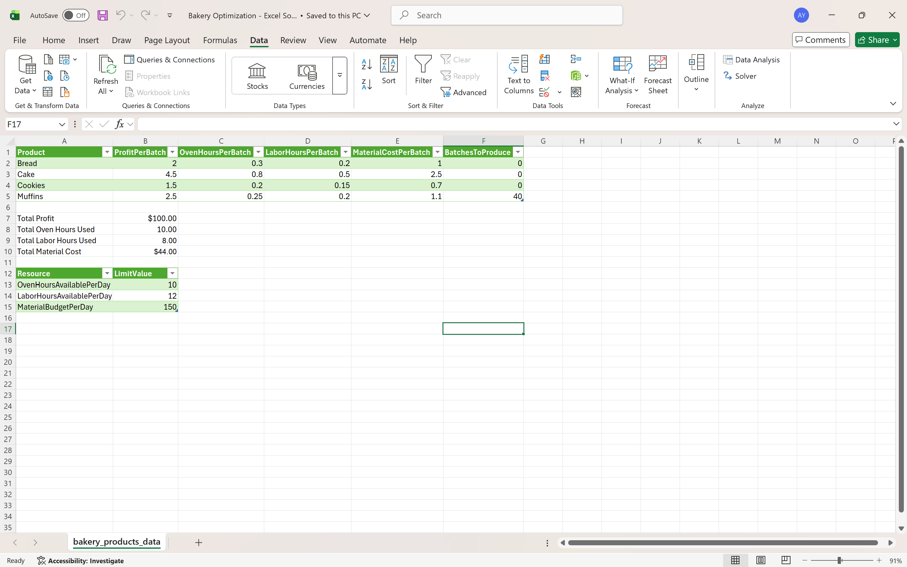
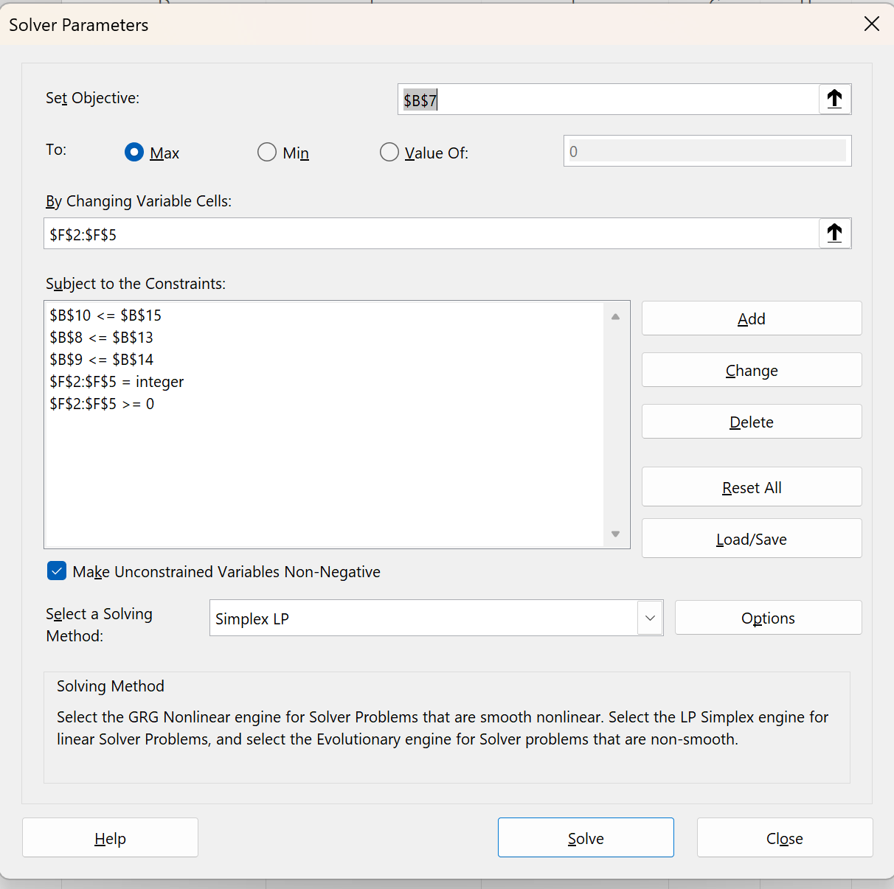

# Bakery Production Optimization

## Overview
This project uses Excel Solver to build a production optimization model for a bakery. The model determines how many batches of each product to produce in order to maximize profit while staying within operational limits.

## Objective
To maximize total profit by selecting the best production mix under limited oven hours, labor hours, and material budget.

## Tools Used
- Microsoft Excel
- Excel Solver
- Linear Programming
- Integer Decision Variables

## Products Included
- Bread
- Cake
- Cookies
- Muffins

## Constraints Included
- Oven hours available per day
- Labor hours available per day
- Material budget per day
- Non-negativity constraints
- Integer batch quantities

## What I Did
- Defined profit contribution and resource usage for each product
- Built an optimization model with decision variables representing batch quantities
- Set up the objective function to maximize total profit
- Applied Solver constraints to generate a feasible production plan
- Evaluated operational tradeoffs between profit and limited resources

## Files
- `Bakery_Production_Optimization.xlsx` - Excel Solver optimization model
- `bakery-optimization-preview.png` - worksheet preview
- `solver-settings.png` - Solver setup preview

## Preview
### Model Worksheet

### Solver Setup

## Why This Project Matters
This project demonstrates structured problem-solving, optimization modeling, and Excel-based decision support for operational planning.
